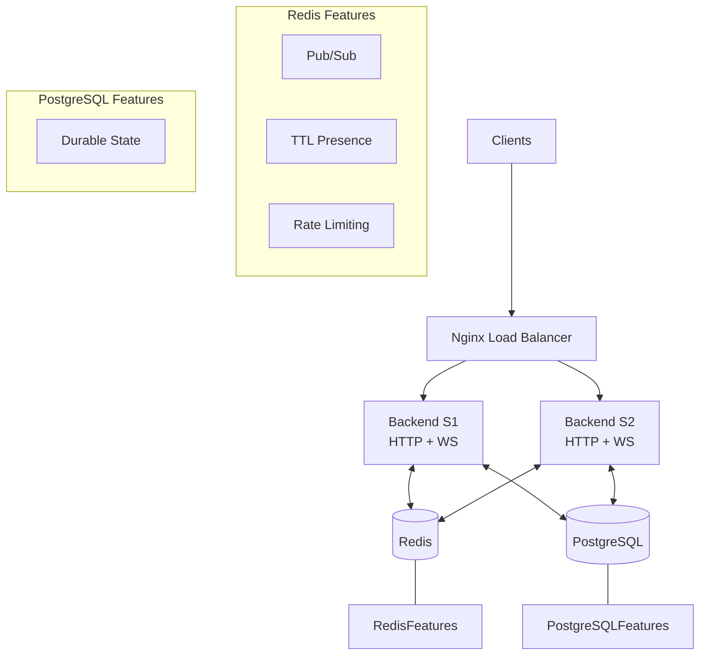

# MakeMake — Final Production Architecture

This document describes the final V1 architecture for the MakeMake collaborative playlist application. It explains the purpose of each component, the data flow, and specifically details why certain common architectural patterns were *not* chosen for this scale.

## 1. System Overview

MakeMake is a real-time, synchronized collaborative playlist application. It allows a Host to create a room and Guests to join, chat, and manipulate a shared playlist. All users in a room see synchronized playback state and presence information.

Because WebSockets are stateful and long-lived, the backend must support horizontal scaling while ensuring that events (like a new chat message) originating on one instance are correctly broadcast to users connected to other instances.

## 2. Architecture Diagram

## 3. Client → Nginx

Clients connect to the application via Nginx, which serves as the reverse proxy and load balancer.
- **HTTP/REST**: Normal API calls (e.g., `POST /rooms`) are routed to backends using a round-robin algorithm.
- **WebSocket Upgrade**: Nginx properly forwards the `Upgrade` and `Connection` headers to establish long-lived WebSocket connections to `/ws`.

## 4. Nginx → Backend Instances

We run multiple identical Node.js backend instances (e.g., `S1`, `S2`).
- **Stateless HTTP**: HTTP requests can be handled by any instance.
- **Passive Health Checks**: Nginx uses `max_fails` and `fail_timeout`. If an instance crashes or returns 5xx errors, Nginx temporarily removes it from the rotation, protecting the user experience.

## 5. WebSocket Architecture

WebSocket connections are pinned to the instance they initially connect to.
- If `Backend S1` dies, the WebSocket connection drops.
- The client automatically reconnects, and Nginx routes the new connection to a healthy instance (e.g., `Backend S2`).
- Cross-instance communication is handled entirely via **Redis Pub/Sub** (see section 7).

## 6. PostgreSQL

PostgreSQL is the **durable source of truth**.
- It stores Rooms, Participants, Songs, and Playlists.
- When a client connects or reconnects, the backend fetches the authoritative `ROOM_STATE` from PostgreSQL.
- If a backend instance dies, the data is safe.

## 7. Redis

Redis provides ephemeral, high-performance capabilities that complement PostgreSQL:
- **Pub/Sub**: When a user sends a message on S1, S1 publishes it to Redis. S2 is subscribed to that room's channel and broadcasts the message to users connected to S2.
- **Presence (TTL)**: Users write a "heartbeat" key to Redis with a short Time-To-Live (TTL). This allows any instance to query who is currently online in a room without writing high-frequency heartbeats to PostgreSQL.
- **Rate Limiting**: Used to implement sliding-window rate limiting to protect endpoints from abuse.

## 8. Room Lifecycle

1. **Creation**: Host creates a room (stored in PG).
2. **Join Requests**: Guests request to join. Host approves/rejects via HTTP API.
3. **Active**: Users connect via WebSocket to exchange state.
4. **Expiry**: When the last participant leaves, an INACTIVE room is assigned a Redis TTL. If nobody reactivates it before the TTL expires, the room is marked CLOSED in PostgreSQL.

## 9. Presence

Rather than a persistent "online/offline" database column, presence is ephemeral. Clients send WebSocket heartbeats. The backend updates a Redis key with an expiry. If the key exists, the user is online.

## 10. Playback Synchronization

The host is the source of truth for playback.
- The host initiates playback events (PLAY, PAUSE, SEEK, NEXT, PREVIOUS).
- These events update PostgreSQL with the authoritative playback anchor (timestamp and position).
- The event is broadcast via Redis Pub/Sub to all backend instances and subsequently to connected clients.
- The frontend uses this server playback anchor along with periodic client-side drift correction to remain synchronized without requiring constant high-frequency broadcasts.

## 11. Host Reconnect Grace

If the Host's WebSocket disconnects (e.g., due to a network blip or backend instance crash):
- A 10-second grace period begins.
- If the Host reconnects within 10 seconds, they retain their Host role.
- If they fail to reconnect, a random connected Member is promoted to Host to ensure the room can continue functioning.

## 12. Rate Limiting

We employ granular rate limiting to protect the system:
- Strict limits on expensive operations (e.g., `POST /rooms` is 5 per minute per IP).
- Relaxed limits on standard endpoints (e.g., fetching state).
- When limits are exceeded, the API returns `429 Too Many Requests`.

## 13. Failure Handling

- **S1 Fails**: Clients disconnect, Nginx routes new connections to S2. Clients reconnect and fetch state.
- **Redis Fails**: PostgreSQL remains available for durable operations, but real-time Pub/Sub, TTL presence, and rate-limited endpoints fail.
- **PostgreSQL Fails**: The application's `/ready` endpoint returns 503, causing Nginx to stop routing traffic. New operations fail.

## 14. Scaling Strategy

The application tier scales horizontally by adding backend instances to the Nginx upstream pool. PostgreSQL and Redis remain shared infrastructure. At larger scale, they would require their own capacity planning, replication, partitioning/clustering, or managed infrastructure.

## 15. Known Limitations & "Why we DON'T use..."

Making engineering decisions requires understanding tradeoffs. Here is why we explicitly avoided certain patterns for MakeMake V1:

- **Redis as the primary database**
  - *No.* PostgreSQL is the durable source of truth. Redis is volatile; if it restarts, we don't want to lose room configuration or playlist data.
- **Sticky Sessions (Session Affinity)**
  - *No.* Sticky sessions make load balancing uneven and complicate failover. Because we use Redis Pub/Sub, any instance can handle any WebSocket connection, allowing purely stateless round-robin routing.
- **Redis Playback Cache**
  - *No.* PostgreSQL is sufficiently fast at our current V1 scale for retrieving the initial `ROOM_STATE`. Adding a caching layer introduces cache invalidation complexity that isn't justified yet.
- **Kafka / Event Sourcing**
  - *No.* Redis Pub/Sub is sufficient for ephemeral room events (chat messages, playback sync). If an event is missed during a reconnection, the client simply fetches the full authoritative state from PostgreSQL. We do not need the durable, replayable event log that Kafka provides.
- **Microservices Architecture**
  - *No.* The MakeMake domain (rooms, participants, playlists) is highly cohesive. Splitting it into microservices would introduce distributed transaction complexity and operational overhead without providing tangible benefits at this stage. A well-structured monolith is the right choice.
